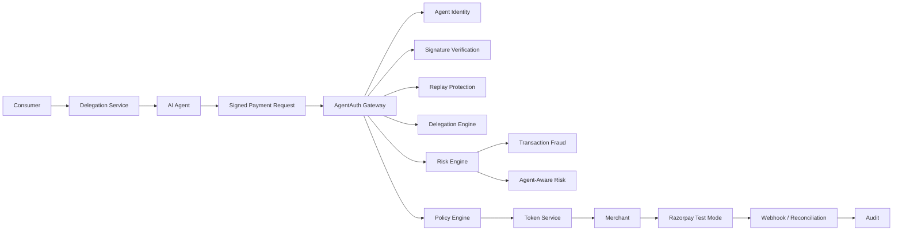
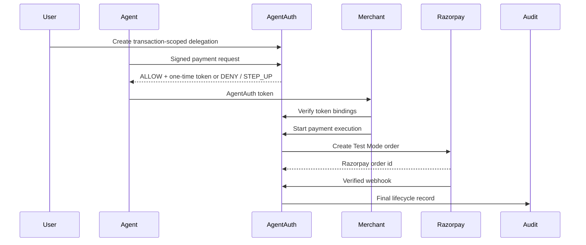

# AgentAuth

AgentAuth is a working delegated-authorization gateway for agentic commerce. AI agents cryptographically identify themselves, consumers grant transaction-scoped authority, AgentAuth independently validates every payment request against that authority, and approved requests receive one-time authorization tokens that merchants can verify before executing payments through Razorpay Test Mode.

The important property: the AI agent never controls its own financial permissions. Even if it is hallucinating, compromised, prompt-injected, or malicious, AgentAuth prevents it from exceeding the authority granted by the consumer.

AgentAuth also verifies whether the transaction and the autonomous agent's behavior are consistent with legitimate historical patterns. Traditional fraud systems ask whether the transaction looks suspicious; AgentAuth additionally asks whether the AI agent initiating it is behaving suspiciously.

## 30-Second Architecture





## Live Demo

```bash
cd /Users/vigneshanand/Documents/Codex/2026-08-24/build/work/agentauth
npm run seed
npm start
```

Open `http://127.0.0.1:8787`.

Run the attack/authorization demo:

```bash
npm run demo
```

Open the attack simulator:

```text
http://127.0.0.1:8787/security-lab
```

## Live Backend

Public backend URL: https://agentauth.vercel.app

Health URL: https://agentauth.vercel.app/api/health, with compatibility rewrite at `https://agentauth.vercel.app/health`.

Razorpay integration: not configured for this deployment milestone.

Persistence: current demo store, backed by JSON at `${DATA_DIR}/agentauth.json`.

Deployment docs:

- `docs/backend-deployment-audit.md`
- `docs/deployment.md`
- `docs/deployment-limitations.md`
- `docs/deployment-status.md`
- `docs/vercel-migration-audit.md`

Public smoke test:

```bash
python3 scripts/smoke_test_public_backend.py --base-url https://agentauth.vercel.app --run-demo-flow
```

## Demo Credentials

Seed data creates:

- consumer: `user_123`
- agent: `agent_7F92A`
- merchant: `merchant_demo_electronics`
- order: `ORD-1934`
- amount: `INR 4999`
- demo private key: `data/demo-agent-private.pem`

The UI clearly labels Razorpay Test Mode. No real money is moved.

## 5-Minute Demo Steps

1. Show the consumer dashboard and active delegation for Shopping Copilot.
2. Run a valid signed request and show `VALID_SIGNATURE`, `DELEGATION_VALID`, `LOW_RISK`, and `ALLOW`.
3. Show merchant token verification checks: signature, issuer, expiry, merchant, order, amount, one-time status.
4. With Razorpay credentials configured, start payment execution and receive a real Razorpay Test Mode order id.
5. Use Security Lab for amount escalation, merchant substitution, tampering, replay, expired delegation, invalid signature, prompt injection, and high-risk step-up.
6. Use Security Lab fraud cases for high-value anomaly, velocity attack, merchant-spread spike, denial spike, recent key rotation, and compromised-agent burst.
7. Open the audit timeline/export to show each authorization, fraud, agent-risk, and policy reason.

## Razorpay Test Mode

AgentAuth authorization is separate from Razorpay payment execution.

Set:

```bash
export PAYMENT_PROVIDER=razorpay
export RAZORPAY_KEY_ID=...
export RAZORPAY_KEY_SECRET=...
export RAZORPAY_WEBHOOK_SECRET=...
```

If these are missing, `/health` reports Razorpay unavailable and `/v1/payments/create-order` refuses to fake a Razorpay order. For local unit tests only, explicitly set:

```bash
export PAYMENT_PROVIDER=mock
```

## Protocol

Agents sign this canonical UTF-8 text with Ed25519:

```text
agent_id=agent_7F92A
delegation_id=del_9217
merchant_id=merchant_demo_electronics
order_id=ORD-1934
amount=4999
currency=INR
nonce=abc123
timestamp=2026-08-24T10:31:20Z
```

Changing any signed field after signing produces `INVALID_SIGNATURE`.

## Main API

- `POST /v1/agents`
- `POST /v1/agents/{agent_id}/rotate-key`
- `POST /v1/agents/{agent_id}/revoke`
- `POST /v1/delegations`
- `POST /v1/authorize-payment`
- `POST /v1/authorization-requests/{request_id}/approve`
- `POST /v1/verify-payment-token`
- `POST /v1/payments/create-order`
- `POST /v1/payments/verify`
- `POST /webhooks/razorpay`
- `GET /v1/authorization-requests/{id}/audit/export`
- `GET /health`

## Security Model

- agent identity is cryptographic, not just a string
- valid identity does not imply spending authority
- delegation is transaction-specific
- nonce and timestamp block request replay
- signed one-time tokens block payment-token replay
- final decisions are deterministic policy, not LLM judgment
- audit events are hash-chained for tamper evidence
- transaction fraud scoring and agent behavior scoring remain separate
- suspicious agent behavior can force step-up even when a transaction is otherwise valid

See `docs/threat-model.md`, `docs/protocol.md`, `docs/current-state-audit.md`, `docs/mock-boundaries.md`, and `docs/fraud-agent-risk.md`.

## Fraud and Agent-Aware Risk

The risk pipeline is:

```text
Hard authorization checks
  -> transaction fraud engine
  -> agent behavior risk engine
  -> risk aggregator
  -> policy engine
```

Hard failures always override fraud scoring. For example, `AMOUNT_EXCEEDS_DELEGATION` is always `DENY`, even if fraud probability is low.

Risk APIs:

- `GET /v1/risk/requests/{request_id}`
- `GET /v1/risk/agents/{agent_id}`
- `GET /v1/risk/users/{user_id}`
- `GET /v1/risk/merchants/{merchant_id}`
- `GET /v1/agents/{agent_id}/reputation`
- `GET /v1/agents/{agent_id}/risk-history`

## Tests

```bash
npm test
```

Covered locally:

- valid Ed25519 signatures and fixture vectors
- tampered amount, merchant, order, nonce, timestamp
- nonce replay
- delegation scope failures
- expired delegation
- revoked agent
- `STEP_UP` approval
- one token producing exactly one payment execution under 100 concurrent attempts
- deterministic transaction fraud scoring
- deterministic agent-aware risk scoring
- combined risk policy
- reputation changes after policy violations

## Limitations

AgentAuth does not provide legal KYC, replace a payment processor, store payment credentials, authorize bank debits directly, or move real money in Razorpay Test Mode. The current persistence layer is local JSON for demoability; production should use PostgreSQL transactions, row locks, unique constraints, migrations, and real RBAC.
