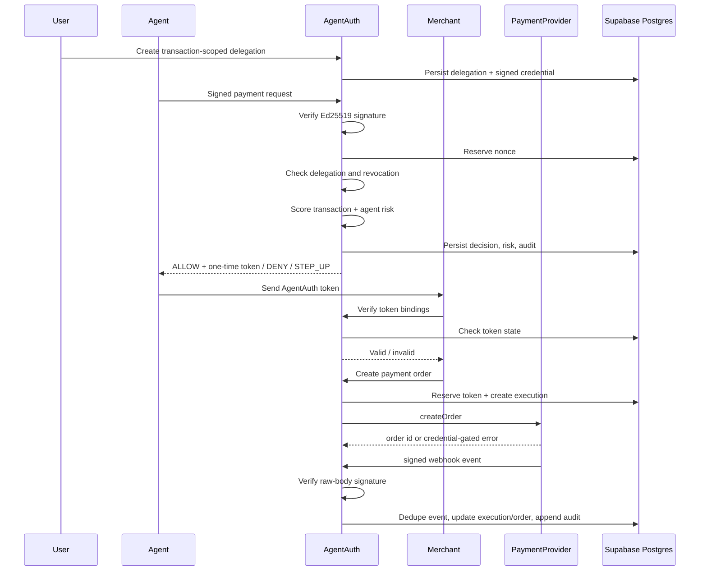

# Sequence Diagram

```mermaid
sequenceDiagram
  participant User
  participant Agent
  participant AgentAuth
  participant Merchant
  participant Provider as PaymentProvider
  participant DB as Supabase Postgres

  User->>AgentAuth: Create transaction-scoped delegation
  AgentAuth->>DB: Persist delegation + signed credential
  Agent->>AgentAuth: Signed payment request
  AgentAuth->>AgentAuth: Verify Ed25519 signature
  AgentAuth->>DB: Reserve nonce
  AgentAuth->>AgentAuth: Check delegation and revocation
  AgentAuth->>AgentAuth: Score transaction + agent risk
  AgentAuth->>DB: Persist decision, risk, audit
  AgentAuth-->>Agent: ALLOW + one-time token / DENY / STEP_UP
  Agent->>Merchant: Send AgentAuth token
  Merchant->>AgentAuth: Verify token bindings
  AgentAuth->>DB: Check token state
  AgentAuth-->>Merchant: Valid / invalid
  Merchant->>AgentAuth: Create payment order
  AgentAuth->>DB: Reserve token + create execution
  AgentAuth->>Provider: createOrder
  Provider-->>AgentAuth: order id or credential-gated error
  Provider->>AgentAuth: signed webhook event
  AgentAuth->>AgentAuth: Verify raw-body signature
  AgentAuth->>DB: Dedupe event, update execution/order, append audit
```
